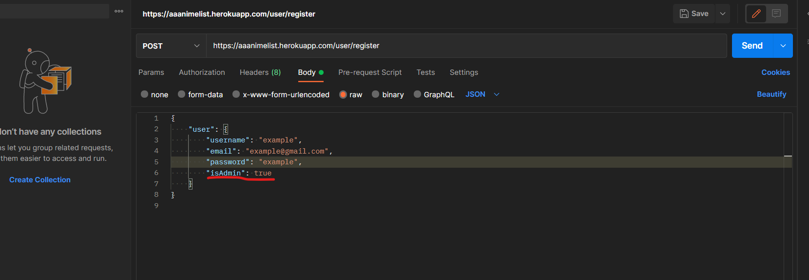
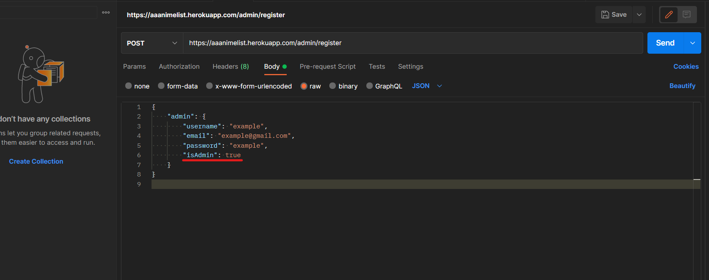
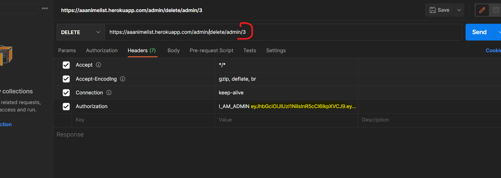

# AnimeList Server 

## This server uses things like:
* Framework
    * Node.js
* Libraries
    * Express
    * Sequelize
    * jsonwebtoken
    * bcrypt
    * dotenv
* Libraries for parsing
    * cheerio
    * request

---
## Models

Folder models includes 4 files (index.js is router)

* user
    * username (string, unique)
    * email (string, unique)
    * password (string)
    * isAdmin (boolean)

* admin
    * username (string, unique)
    * email (string, unique)
    * password (string)
    * isAdmin (boolean)

* anime
    * title_name (string(TEXT), unique)
    * title_english (string(TEXT))
    * description (string(TEXT))
    * episodes (integer)
    * studios (string)
    * genres (string)
    * duration (string)
    * rating (string)
    * img (string)
    * animeType (string)
    * youTubeVideo (string)
    * owner_id (integer)

---
## Endpoints

## user/ 
* user/allUsers --->   list of user (can get only admin)

* user/register ---> register user

* user/login ---> login user

* user/edit/user/:id ---> user can update his info (for updating we need user id)

* user/delete/user/:id ---> user can update his info (for deleting we need user id)

---
## admin/

* admin/register ---> register admin

* admin/login ---> login admin

* admin/delete/user/by/admin/:id ---> admin can delete user by id

* admin/delete/admin/:id ---> admin can be deleted by id

---
## anime/

* anime/pars ---> parsing site(can only admin)

* anime/create ---> create anime(can only admin)

* anime/all ---> get all animes

* anime/:genres ---> get anime by genre(can only admin){but don't remember is this endpoint using}

* anime/find/:title_name ---> find name of title

* anime/edit/:id ---> edit anime(can only admin)

* anime/delete/:id ---> delete anime(can only admin)
---
## Access to admin button

In Postmen you will must to write that line of JSON (this line will allow you to see | Login Admin button |)

---
## Admin Sign Up

In Postmen you will must to write that line of JSON (this line will allow you to see | Admin Panel |)

---
## Delete Admin

In Postmen you will must to put in Authorization line "I_AM_ADMIN" and admin token (yellow text)

